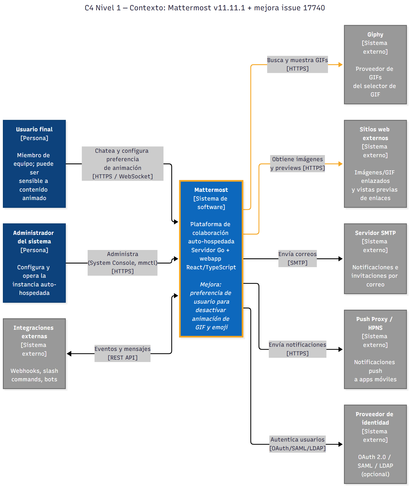
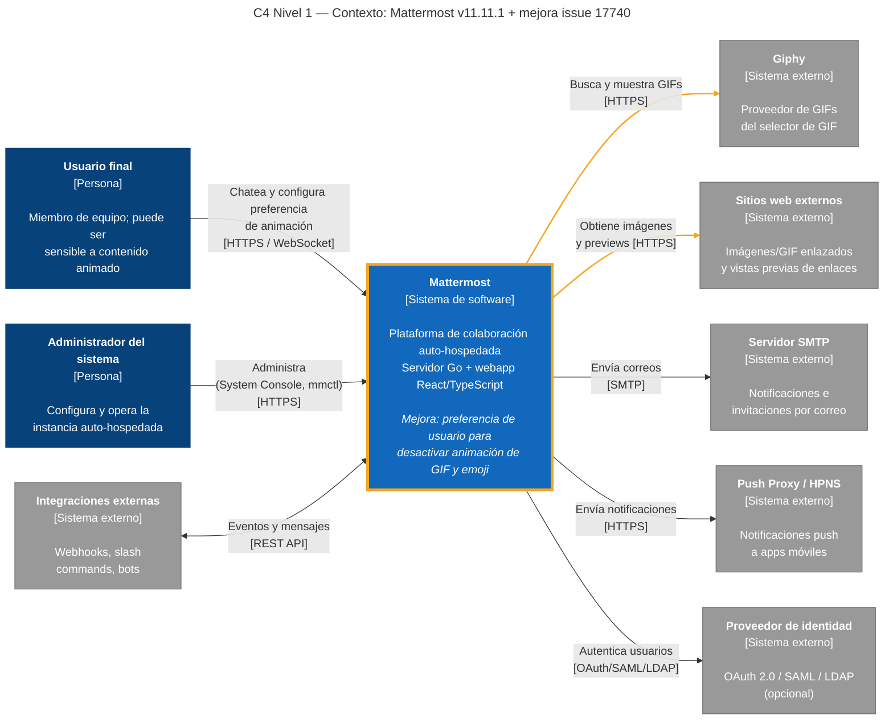

# Diagrama de arquitectura preliminar — C4 Nivel 1: Contexto (E1-h)

Diagrama "as code" en Mermaid. Fuente: [`c4-contexto.mmd`](c4-contexto.mmd).
Imagen generada con Mermaid CLI: `npx @mermaid-js/mermaid-cli -i c4-contexto.mmd -o c4-contexto.png -s 2 -b white`

> Notación C4 sobre `flowchart` de Mermaid (el tipo `C4Context` nativo es experimental y genera solapamientos).
> Borde naranja = sistema que recibe la mejora; flechas naranjas = flujos de contenido animado afectados.

## Fuente

## Elementos
| Elemento | Tipo | Descripción | Relación con la mejora |
|---|---|---|---|
| Usuario final | Persona | Miembro de equipo que usa canales, DMs e hilos | Activa/desactiva la preferencia de animación |
| Administrador | Persona | Opera la instancia (System Console, mmctl) | Sin cambios en el alcance |
| Mattermost | Sistema | Servidor Go + webapp React/TS; PostgreSQL y almacenamiento de archivos son internos (nivel 2) | Recibe la nueva preferencia y el render estático de GIF/emoji |
| Giphy | Externo | Proveedor del selector de GIF | Sus GIFs se mostrarán estáticos si la preferencia está desactivada |
| Sitios web externos | Externo | Imágenes/GIF enlazados y previews | Igual que Giphy |
| SMTP / Push / IdP / Integraciones | Externos | Correo, push, autenticación, webhooks | Sin impacto |

## Notas
- Versión preliminar; se actualiza en E2 (nivel 2 — contenedores) y en la entrega final.
